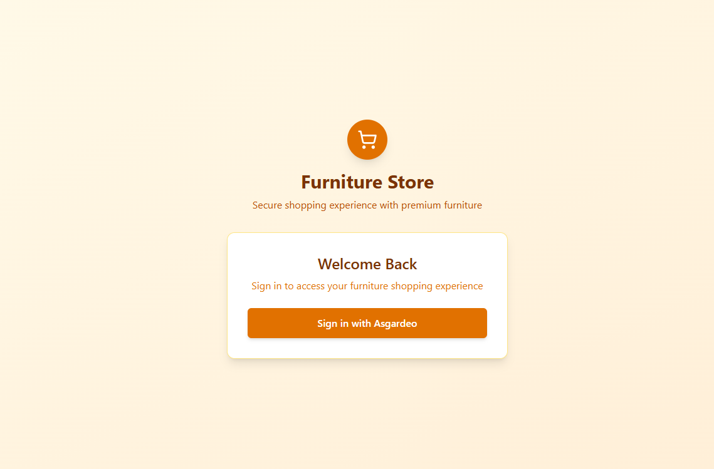
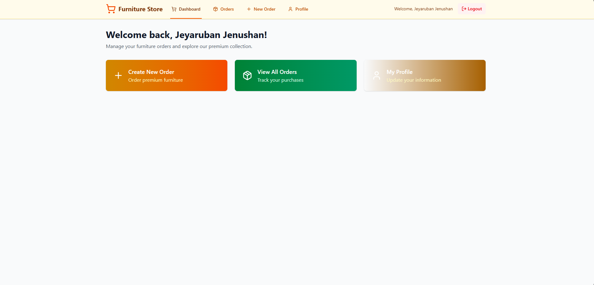
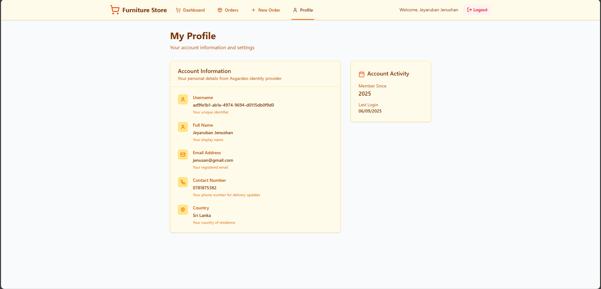
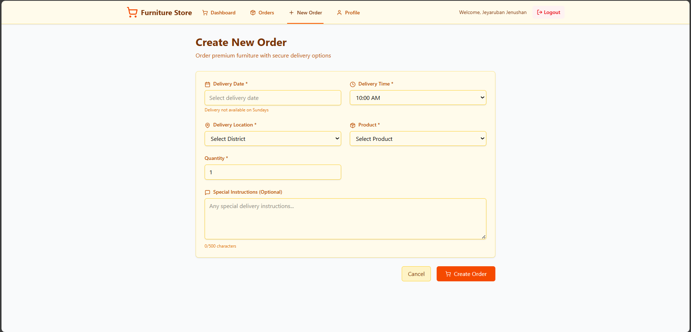
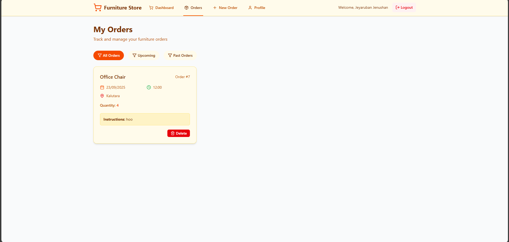
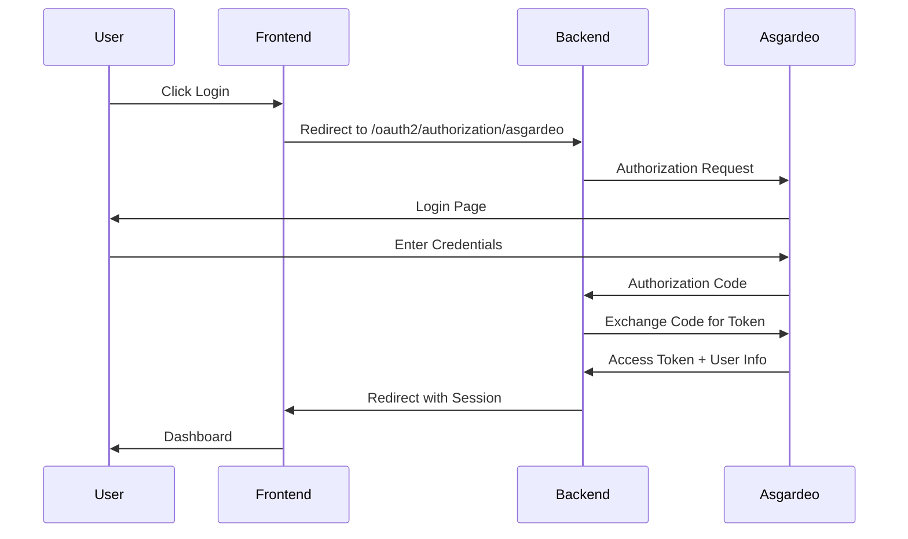

# Furniture E-commerce - Secure Web Application

A comprehensive, secure furniture e-commerce web application built with **React**, **Spring Boot**, **MySQL**, and **Asgardeo OIDC Authentication**. This project demonstrates enterprise-grade security practices while addressing OWASP Top 10 vulnerabilities and implementing modern authentication protocols.

## 🏆 Assessment Overview

This project was developed as part of **Secure Web Application Development** to evaluate understanding and practical implementation of:

- **Information Security** best practices
- **OWASP Top 10** vulnerability mitigation
- **OIDC Authentication** with cloud-based Identity Provider
- **Access Control** and secure data handling
- **Full-stack development** with modern technologies

## 🎯 Key Features

### 🔐 Security Features

- **OIDC Authentication** with Asgardeo
- **OWASP Top 10** compliance
- **HTTPS** enforcement
- **Input validation** and sanitization
- **SQL injection** prevention
- **XSS protection**
- **CSRF protection**
- **Access control** with JWT tokens

### 📱 Application Features

- **User Authentication** (Login/Logout)
- **User Profile Management**
- **Product Ordering System**
- **Order Management** (View, Create, Delete)
- **Delivery Scheduling**
- **District-wise Delivery**
- **Order History Tracking**

## 🏗️ Technology Stack

### Backend

- **Framework**: Spring Boot 3.2.0
- **Security**: Spring Security with OAuth2
- **Database**: MySQL 8.0
- **ORM**: JPA/Hibernate
- **Authentication**: Asgardeo OIDC

### Frontend

- **Framework**: React 18 with Vite
- **Styling**: Tailwind CSS
- **State Management**: React Query
- **Forms**: React Hook Form
- **Icons**: Lucide React
- **Date Picker**: React DatePicker

### Infrastructure

- **Authentication Provider**: Asgardeo (WSO2)
- **Database**: MySQL
- **Development Server**: Vite (Frontend), Spring Boot (Backend)
- **Security**: HTTPS, SSL/TLS

## 🚀 Getting Started

### Prerequisites

Before running the application, ensure you have:

- **Java 17+**
- **Node.js 18+**
- **MySQL 8.0+**
- **Git**
- **Asgardeo Account** (Free tier available)

### 🔧 Environment Setup

#### 1. Clone Repository

```bash
git clone https://github.com/jeyjenushan/FurnitureEcommerceWebsite.git
cd FurnitureEcommerceWebsite
```

#### 2. Database Setup

```bash
# Login to MySQL
mysql -u root -p

# Create database
CREATE DATABASE furniture_ecommerce CHARACTER SET utf8mb4 COLLATE utf8mb4_unicode_ci;

# Create user (optional)
CREATE USER 'user'@'localhost' IDENTIFIED BY 'your_password';
GRANT ALL PRIVILEGES ON furniture_ecommerce.* TO 'user'@'localhost';
FLUSH PRIVILEGES;
```

#### 3. Asgardeo Configuration

1. **Create Asgardeo Account**: Visit [https://asgardeo.io](https://asgardeo.io)
2. **Create Application**:
   - **Application Type**: Traditional Web Application
   - **Grant Types**: Authorization Code, Refresh Token
   - **Callback URLs**: `https://localhost:8443/login/oauth2/code/asgardeo`
   - **Logout URLs**: `https://localhost:5173`
   - **Scopes**: `openid`, `profile`, `email`, `address`, `phone`, `groups`, `roles`

#### 4. Backend Configuration

Create environment variables or update `application.properties`:

```bash
# Environment Variables (Recommended)
export DATABASE_URL="jdbc:mysql://localhost:3306/furniture_ecommerce?useSSL=false&serverTimezone=UTC&allowPublicKeyRetrieval=true"
export DATABASE_USERNAME="root"
export DATABASE_PASSWORD="your_mysql_password"
export ASGARDIO_CLIENT_ID="your_asgardeo_client_id"
export ASGARDIO_CLIENT_SECRET="your_asgardeo_client_secret"
export ASCARDIO_REDIRECT_URI="http://localhost:8443/login/oauth2/code/asgardeo"
export ASGARDIO_ISSUE_URI="https://api.asgardeo.io/t/your_org/oauth2/token"
export FRONTEND_URL="https://localhost:5173"
```

#### 5. Frontend Configuration

Create `.env` file in the client directory:

```env
VITE_API_URL="https://localhost:8443/api"
VITE_ASGARDEO_BASE_URL="https://api.asgardeo.io/t/your_org"
VITE_ASGARDEO_CLIENT_ID="your_asgardeo_client_id"
VITE_REDIRECT_URI="https://localhost:5173/auth/callback"


```

### 🏃‍♂️ Running the Application

#### Backend (Spring Boot)

```bash
cd server
./mvnw clean install
./mvnw spring-boot:run
```

Backend will be available at: **https://localhost:8080**

#### Frontend (React + Vite)

```bash
cd client
npm install
npm run dev
```

Frontend will be available at: **https://localhost:5173**

## 📸 Application Screenshots

### Home Page



### Dashboard


_User dashboard with quick actions and order statistics_

### User Profile


_Authenticated user profile information_

### Create Order


_Secure order creation with validation_

### Order Management


_View and manage all orders with filtering options_

## 🔒 Security Implementation

### OWASP Top 10 Mitigation

| Vulnerability                        | Mitigation Strategy                                |
| ------------------------------------ | -------------------------------------------------- |
| **A01: Broken Access Control**       | OAuth2 authentication, role-based access control   |
| **A02: Cryptographic Failures**      | HTTPS, encrypted data storage, secure JWT tokens   |
| **A03: Injection**                   | Parameterized queries, input validation, ORM usage |
| **A04: Insecure Design**             | Threat modeling, secure architecture patterns      |
| **A05: Security Misconfiguration**   | Secure headers, environment-based configs          |
| **A06: Vulnerable Components**       | Regular dependency updates, security scanning      |
| **A07: Identity/Authentication**     | OIDC with Asgardeo, secure session management      |
| **A08: Software/Data Integrity**     | Input validation, secure API design                |
| **A09: Security Logging**            | Comprehensive logging, security monitoring         |
| **A10: Server-Side Request Forgery** | Input validation, whitelist approach               |

### Authentication Flow



## 📂 Project Structure

```
FurnitureEcommerceWebsite/
├── client/                          # React Frontend
│   ├── src/
│   │   ├── components/             # React components
│   │   ├── contexts/              # React contexts
│   │   ├── services/              # API services
│   │   └── styles/                # CSS files
│   ├── public/                    # Static assets
│   └── package.json
├── server/                          # Spring Boot Backend
│   ├── src/main/java/
│   │   ├── config/                # Configuration classes
│   │   ├── controller/            # REST controllers
│   │   ├── entity/                # JPA entities
│   │   ├── repository/            # Data repositories
│   │   ├── security/              # Security configurations
│   │   └── service/               # Business logic
│   ├── src/main/resources/
│   │   └── application.properties
│   └── pom.xml
├── screenshots/                     # Application screenshots
├── videos/                         # Demo videos
├── database/                       # Database scripts
│   └── schema.sql
└── README.md
```

## 🚀 Deployment

### Local Development Deployment

```bash
# Build and run with Docker Compose
docker-compose up --build

# Services will be available at:
# Frontend: https://localhost:5173
# Backend: https://localhost:8080
# MySQL: localhost:3306
```

#### Manual Deployment

1. **Build Backend**:

```bash
cd server
./mvnw clean package
java -jar target/ecommerce-backend-1.0.0.jar
```

2. **Build Frontend**:

```bash
cd client
npm run build
# Serve the build folder using a web server
```


## 🔍 API Documentation

### Authentication Endpoints

- `GET /oauth2/authorization/asgardeo` - Initiate OAuth2 login
- `GET /api/auth/user` - Get current user information
- `POST /api/auth/logout` - User logout

### User Endpoints

- `GET /api/user/profile` - Get user profile

### Order Endpoints

- `GET /api/orders` - Get all user orders
- `GET /api/orders/upcoming` - Get upcoming orders
- `GET /api/orders/past` - Get past orders
- `POST /api/orders` - Create new order
- `DELETE /api/orders/{id}` - Delete order
- `GET /api/orders/config` - Get order configuration

## 📊 Database Schema

```sql
-- Users Table
CREATE TABLE users (
    username VARCHAR(255) PRIMARY KEY,
    name VARCHAR(255) NOT NULL,
    email VARCHAR(255) NOT NULL UNIQUE,
    contact_number VARCHAR(20),
    country VARCHAR(100) NOT NULL,
    created_at TIMESTAMP DEFAULT CURRENT_TIMESTAMP
);

-- Orders Table
CREATE TABLE orders (
    id BIGINT AUTO_INCREMENT PRIMARY KEY,
    username VARCHAR(255) NOT NULL,
    purchase_date DATE NOT NULL,
    delivery_time TIME NOT NULL,
    delivery_location VARCHAR(255) NOT NULL,
    product_name VARCHAR(255) NOT NULL,
    quantity INT NOT NULL,
    message TEXT,
    created_at TIMESTAMP DEFAULT CURRENT_TIMESTAMP,
    FOREIGN KEY (username) REFERENCES users(username)
);
```

## 🐛 Troubleshooting

### Common Issues

#### 1. Authentication Issues

```bash
# Check Asgardeo configuration
# Verify callback URLs match exactly
# Ensure client ID and secret are correct
# Check organization name in URLs
```


#### 2. CORS Issues

```bash
# Verify frontend URL in backend configuration
# Check credentials are included in requests
# Ensure proper CORS headers
```


## 📝 Assessment Deliverables

### ✅ Completed Requirements

- [x] **OIDC Authentication** with Asgardeo
- [x] **User Profile Display** with authenticated user information
- [x] **Order Management System** with all required fields
- [x] **OWASP Top 10** security implementations
- [x] **Access Control** based on authentication tokens
- [x] **HTTPS Configuration** for secure communications
- [x] **Configurable Parameters** via environment variables
- [x] **Database Integration** with MySQL
- [x] **Comprehensive Documentation**

### 📋 Submission Checklist

- [x] Source code uploaded to public GitHub repository
- [x] Sensitive data removed and configurable via environment variables
- [x] Database creation scripts included
- [x] Complete README with deployment instructions
- [x] Screenshots and demo videos included
- [x] Blog post published on Medium
- [x] JSON file with submission details

## 🏆 Assessment Results

This project demonstrates:

- **Security-First Approach**: Comprehensive OWASP Top 10 mitigation
- **Modern Authentication**: OIDC implementation with enterprise IDP
- **Full-Stack Expertise**: React + Spring Boot integration
- **Production-Ready Code**: Proper error handling, validation, logging
- **Documentation Excellence**: Complete setup and deployment guides

## 📞 Support

For questions or issues:

- 📧 Email: jeyarubanjenushan3@gmail.com
- 📖 Documentation: [Medium](https://medium.com/@jeyarubanjenusan/building-a-secure-furniture-e-commerce-application-a-comprehensive-journey-through-modern-web-9e8654250a83)
-  Demo Video:[Demo](https://drive.google.com/file/d/1uKcF4BUDRMlTMmt5VEt1jRjdNZ9dIG8F/view?usp=sharing)

## 🙏 Acknowledgments

- **WSO2 Asgardeo** for providing excellent OIDC services
- **Spring Security** team for comprehensive security framework
- **React Community** for outstanding frontend ecosystem
- **OWASP Foundation** for security guidelines and best practices

---


---

_Built with ❤️ for secure e-commerce experiences_


